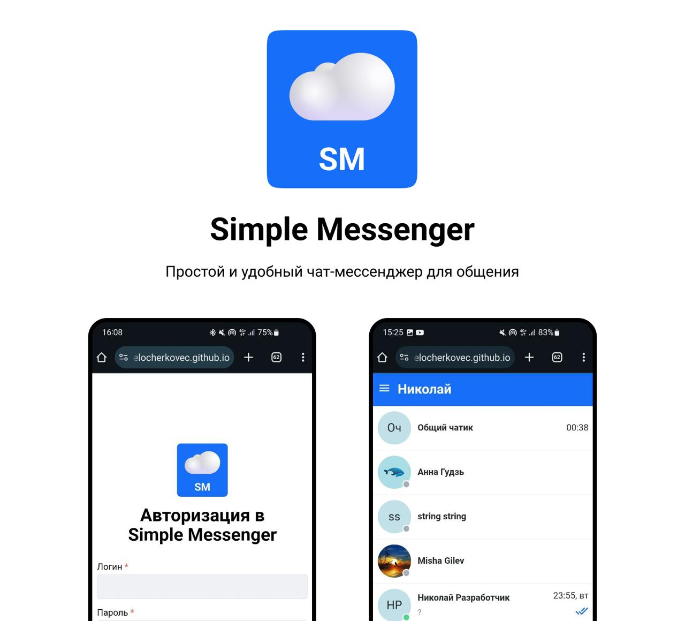

# Simple Messenger

Веб приложение для онлайн общения, обмена фотографиями и голосовыми сообщениями.

Доступно по ссылке: [**Simple Messenger**](https://belocherkovec.github.io/2024-2-VK-EDU-Frontend-N-Kobyakov/).

## Стек


HTML, CSS, SCSS, JavaScript, TypeScript, React, React Router, Redux Toolkit, Axios, Centrifugo, Vite, Eslint, Prettier.

## Возможности приложения

#### Аккаунт
- Авторизация
- Регистрация

#### Настройки:
- Редактирование информации о себе (username, имя, фамилия, биография)
- Загрузка / Редактирование аватара
- Выход из профиля
- Удаление профиля

#### Чаты
- Приватные чаты с одним собеседником
- Групповые чаты

#### Чат
- Создание приватного чата
- Удаление приватного чата
- Выход из группового чата
- Отправка сообщений
- Чтение сообщений (смена статуса на "прочитано")
- Редактирование сообщений
- Удаление сообщений
- Загрузка изображений (.jpeg, .png, до 5 шт.)
- Запись и отправка голосового сообщения
- Отправка геопозиции

#### Прочее
- Real-time обновления с использованием сокета на centrifugo
- Браузерные уведомления о новых сообщениях
- Внутренние уведомления об успешных / неудачных действиях
- Своя библиотека компонентов (кнопки, модальные окна, dialog-popup, контекстное меню)
- LazyLoading для изображений
- Валидация ввода
- Уведомления пользователя о нововведениях в приложении


### Развитие

[Roadmap по развитию и доработкам проекта (figma)](https://www.figma.com/design/AwBdr8q3SdfZmqnB1b2o5v/Vk_education.-Simple-chat.?node-id=288-228&t=HHUV3PGLJztZN7yM-1)

## Инструкция 
**Для корректной работы необходимо настроить интеграцию с API:** [Ссылка на документацию по API](https://github.com/education-vk-company/vk-edu-messenger-backend/tree/main)

### Запуск клиентской части

1. Открываем терминал в папке с проектом

2. Устанавливаем зависимости:
```bash
npm i
```
3. Запускаем приложение:
```bash
npm run dev
```


    

